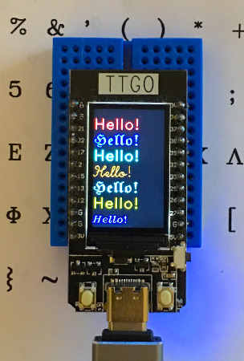

ttgo-lcd-demo
=============

MicroPython Hershey fonts demo for the TTGO-LCD using the st7789py_mpy driver
from https://github.com/devbis/st7789py_mpy

|

|

I pulled this from the oledui module I wrote for my `TurtlePlotBot
<https://github.com/russhughes/TurtlePlotBot>`_ it's not fast but it works
and should be easy to modify to run on most any board and display.

File Based Fonts
================

There are trade-offs between speed and memory use between the two font methods.
The file based fonts use less memory but a slower then the memory fonts.

Demo Installation
-----------------

Copy fhello.py to the MicroPython device then create a /fonts directory
and copy all the fnt files from the repos /fonts directory into it.  I use
`mpfshell <https://github.com/wendlers/mpfshell>`_ to copy files.

import fhello to run.

Memory Based Fonts
==================

The memory fonts use more memory since the font is loaded into memory
for use but they are faster the the file based fonts.  Memory use can be
reduced by Freezing the bytecode in the firmware.

I'm planning on writing a 'C' version that should be even faster.

Demo Installation
-----------------

Copy pyhello.py to the MicroPython device the create a /pyfonts directory then
copy all the py files in the repos /pyfonts directory to it. I use `mpfshell
<https://github.com/wendlers/mpfshell>`_ to copy files.

import pyhello to run.

